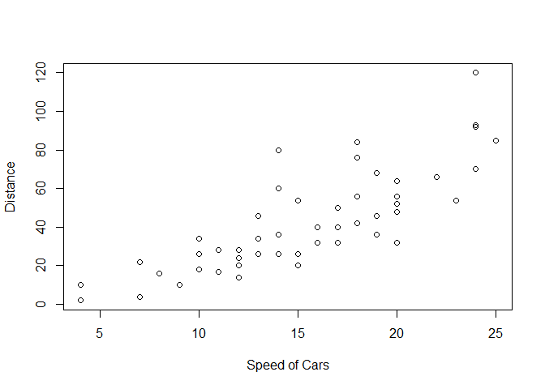

------------------------------------------------------------------------

output: md\_document: variant: markdown\_github ---

**STAT 545 Repository**
=======================

This is a repository made by **Hamid Omid** for course work of **[STAT 545](https://github.com/STAT545-UBC)** offered at the **[Universty of Bristish Columbia](https://en.wikipedia.org/wiki/University_of_British_Columbia)** in **Fall 2015**. Here is the link to main-page of course: [STAT 545 webpage](http://stat545-ubc.github.io). The course is offered by **[Jenny](https://github.com/jennybc)**. I am excited to push my programming skills and data analysis expertise to a higher level.

I am in the last year of my PhD studying theoretical physics. My supervisor is **[Gordon Semenoff](https://en.wikipedia.org/wiki/Gordon_Walter_Semenoff)**. I am interested in Quantum Field Theories and their applications to Condensed Matter Systems. I have spent most of my recent years doing analytic calculations. I live in beautiful city of Vancouver. Here is a picture of our Campus at **UBC**:


To put this file on **GitHub**, I used **Git** through my **RStudio**. I used **R Mark Down** to write the original file and then **Knitted** it into **Mark Down**. To do so, I used the command

``` [r}
---
output:
  md_document:
    variant: markdown_github
---
```

My experience was not that pleasant as there were many issues with installing **Git** and connecting it to **RStudio** however I finally survived!

**Warm Up for RStudio**
-----------------------

Let's start by doing some simple math on database "cars" provided by R. Let's load the data first:

``` r
data(cars)
summary(cars)
```

    ##      speed           dist       
    ##  Min.   : 4.0   Min.   :  2.00  
    ##  1st Qu.:12.0   1st Qu.: 26.00  
    ##  Median :15.0   Median : 36.00  
    ##  Mean   :15.4   Mean   : 42.98  
    ##  3rd Qu.:19.0   3rd Qu.: 56.00  
    ##  Max.   :25.0   Max.   :120.00

As we see from the result of "summary" command data has two columns and fifty rows(observations). Lets see what is the data about exactly.

``` r
?cars
```

    ## starting httpd help server ... done

We find out that "the data give the speed of cars and the distances taken to stop. Note that the data were recorded in the 1920s".

Let's plot the data then.

``` r
plot(cars$speed,cars$dist,xlab ="Speed of Cars",ylab="Distance")
```


