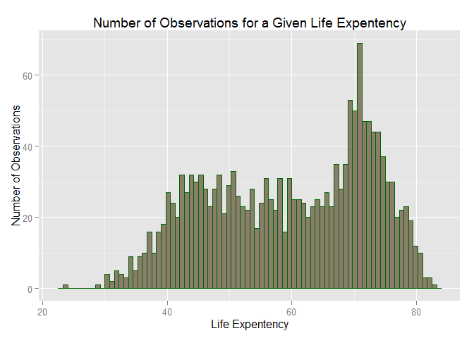
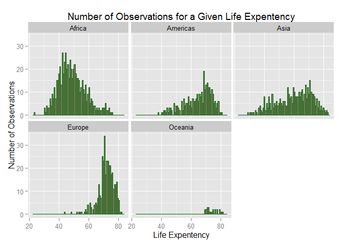
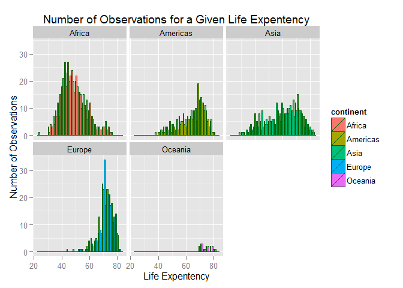
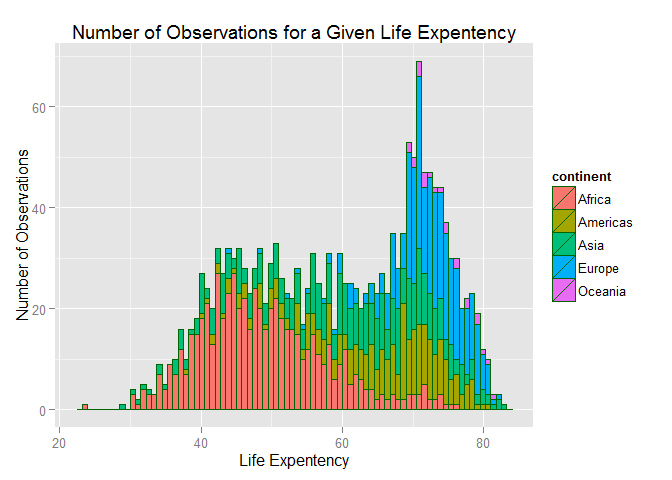
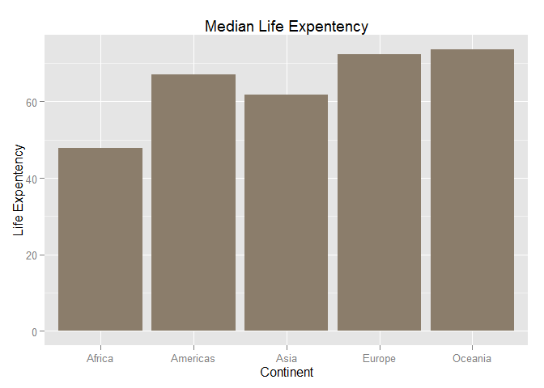
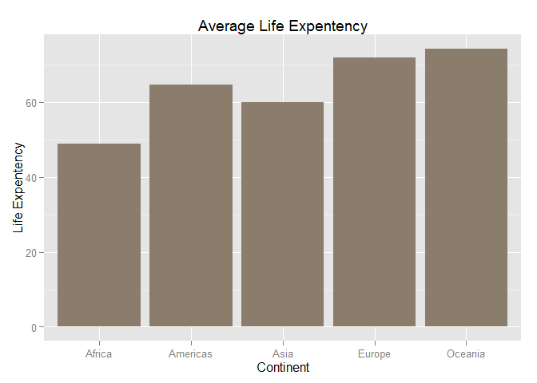
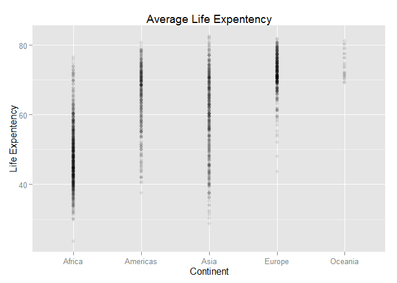
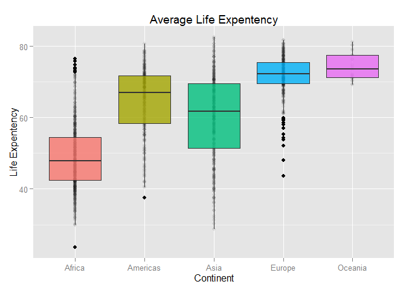

# Stat 545 Home Work 2
**Hamid Omid**  


#Introduction

In this homework, we are going to play with some data from ["gapminder"](http://www.gapminder.org/) data and make many plots to get familiar with ["ggplot2"](https://en.wikipedia.org/wiki/Ggplot2). "ggplot2" is a package which is user friendly and makes our life as data geeks easier! Note that I have turned off the out-put of some chunks by using the command **"message=FALSE"** and **"warning=FALSE"**. To make it more pedagogical, I tried to bold new commands that I learned through this homework.

I used the following lines of code to add a table of contents and number the sections.


```r
---title: "Stat 545 Home Work 2"
author: "Hamid Omid"
output: 
  html_document:
    keep_md: yes
    toc: true
    number_sections: true
---
```

***

#Data and Packages

Let's start by installing the package that provides us with the data. 

```r
install.packages("gapminder",repos="http://cran.rstudio.com/")
```

We used the option "**results="hide"**" to suppress the out-put. We need some other packages as well, let me define a function to check if they are already installed if not it installs the package.


```r
pkgTest <- function(x)
  {
    if (!require(x,character.only = TRUE))
    {
      install.packages(x,dep=TRUE)
        if(!require(x,character.only = TRUE)) stop("Package not found")
    }
  }    
```


```r
pkgTest("ggplot2")
pkgTest("dplyr")
```

```
## Warning: package 'dplyr' was built under R version 3.2.2
```

"**dplyr**" is a package that is helpful in statistical analysis.


I needed to specify the repository by typing **"repos=http<span></span>://cran.rstudio.com"** otherwise I would have received an error. The error occurs as **RStudio** is not sure which repository to use. An extra note here! By adding a URL, a hyperlink gets generated automatically. We can add `<span></span>` after "http" to avoid it.

We could get data directly from a URL, for example:


```r
gapminder <-"http://www.stat.ubc.ca/~jenny/notOcto/STAT545A/examples/gapminder/data/gapminderDataFiveYear.txt"
    
gapData <- read.delim(file = gapminder)
```

We put the data in the variable "gapData".

It is nice to call all of the packages that we use at the same-time. Let's call them all here.


```r
library(gapminder)
library(ggplot2)
library(dplyr)
```

***

# Exploring Gapminder Data Structure

Let's start by looking at the structure of data. 


```r
str(gapData)
```

```
## 'data.frame':	1704 obs. of  6 variables:
##  $ country  : Factor w/ 142 levels "Afghanistan",..: 1 1 1 1 1 1 1 1 1 1 ...
##  $ year     : int  1952 1957 1962 1967 1972 1977 1982 1987 1992 1997 ...
##  $ pop      : num  8425333 9240934 10267083 11537966 13079460 ...
##  $ continent: Factor w/ 5 levels "Africa","Americas",..: 3 3 3 3 3 3 3 3 3 3 ...
##  $ lifeExp  : num  28.8 30.3 32 34 36.1 ...
##  $ gdpPercap: num  779 821 853 836 740 ...
```

```r
class(gapData)
```

```
## [1] "data.frame"
```

```r
mode(gapData)
```

```
## [1] "list"
```


"**str()**" shows us that "gapData" is a data.frame with 1704 objects and 6 variables. "**class()**" and "**mode()**" command return "data.frame" and "list" respectively. We could find the number of variables( columns) by the following command

```r
ncol(gapData)
```

```
## [1] 6
```
and the number of rows( objects) could be found by

```r
nrow(gapData)
```

```
## [1] 1704
```
The function "**dim**" gives us both of the number of rows and columns.


```r
dim(gapData)
```

```
## [1] 1704    6
```

Let's summarize the information we got from above commands. The functions that give us the given information are mentioned at the end of each line.
 
* The "gapData" **class** is a data.frame( **str(), class()**)
* There are 1704 **observations**( **rows**) ( **str(), nrow( ), dim( )**)
* There are 6 **variables( columns)** ( **str(), ncol( ), dim( )**)
* The **variables( columns)** are: country, year, pop, continent, lifeExp and gdpPercap( **str(), names()**)
* The **types of variables** are : factor, integer, number (**str()**)
* The **number of levels** for factor variables are 5 for "continent"" and 142 for "country" (**str(), nlevels()**)

Let's summarize the variables class in the following table as well. We could use "**str(gapData)**" or use "**class()**" for each individual variable.

Variable | Class
------------- | -------------
country | factor
year | integer 
pop  | numeric
continent| factor
lifeExp| numeric
gdpPercap| numeric

We could use the following function to find the levels for factor variables.


```r
levels(gapData$continent)
```

```
## [1] "Africa"   "Americas" "Asia"     "Europe"   "Oceania"
```

***

# Exploring Gapminder Data More Deeply

In this section we try to have a more accurate feeling about the data by using more functions. We can use the function "**summary()**" to get some statistical feeling about each variable.


```r
summary(gapData)
```

```
##         country          year           pop               continent  
##  Afghanistan:  12   Min.   :1952   Min.   :6.001e+04   Africa  :624  
##  Albania    :  12   1st Qu.:1966   1st Qu.:2.794e+06   Americas:300  
##  Algeria    :  12   Median :1980   Median :7.024e+06   Asia    :396  
##  Angola     :  12   Mean   :1980   Mean   :2.960e+07   Europe  :360  
##  Argentina  :  12   3rd Qu.:1993   3rd Qu.:1.959e+07   Oceania : 24  
##  Australia  :  12   Max.   :2007   Max.   :1.319e+09                 
##  (Other)    :1632                                                    
##     lifeExp        gdpPercap       
##  Min.   :23.60   Min.   :   241.2  
##  1st Qu.:48.20   1st Qu.:  1202.1  
##  Median :60.71   Median :  3531.8  
##  Mean   :59.47   Mean   :  7215.3  
##  3rd Qu.:70.85   3rd Qu.:  9325.5  
##  Max.   :82.60   Max.   :113523.1  
## 
```

Let's focus on two variables, "continent" and "lifeExp". They were more fun! 
<br><br>

***

## Exploring "continent" Variable 

Let's apply the "summary()" function on "continent".


```r
summary(gapData$continent)
```

```
##   Africa Americas     Asia   Europe  Oceania 
##      624      300      396      360       24
```
It gives us the values( continents) that variable takes and the number of observations for each continent. The best plot for such a variable is a bar-graph. Let's try it!

```r
ggplot(data=gapData,aes(continent))+
geom_bar(fill="bisque4")+
xlab("Continent")+ylab("Number of Observations")+
ggtitle("Number of Observations per Continent")
```

 

You can find many color codes in this [link](http://www.stat.columbia.edu/~tzheng/files/Rcolor.pdf). As before we could use the function "levels()" to get the values the variable takes.

***

## Exploring "lifeExp" Variable

<br>

Let's apply the function "summary()" on the variable of interest "lifeExp", life expectancy.


```r
summary(gapData$lifeExp)
```

```
##    Min. 1st Qu.  Median    Mean 3rd Qu.    Max. 
##   23.60   48.20   60.71   59.47   70.85   82.60
```

This gives us some statistical information about life expectancy in world. Let's summarize it in the following table.

Life Expectancy Statistics| #
------------- | -------------
Min   | 23
Max  | 82 
Average  | 59
Median | 60

A bar-plot might help to understand the distribution better. Let's try it!

```r
ggplot(data=gapData,aes(lifeExp))+
geom_bar(binwidth=.75, fill="bisque4", colour="darkgreen")+
xlab("Life Expentency")+
ylab("Number of Observations")+ggtitle("Number of Observations for a Given Life Expentency")
```

 

            
I changed the default width of bars to make the plot more beautiful and informative about the fluctuation via adding "**geom_bar(binwidth=.75)**" . I changed the color of bars as well by adding "**geom_bar(binwidth=.75, fill="bisque4", colour="darkgreen")**".

Let's look at the life expectancy for each continent. We start by plotting the same plot for each continent.


```r
ggplot(data=gapData,aes(lifeExp))+
geom_bar(binwidth=.75,fill="bisque4", colour="darkgreen")+
facet_wrap(~ continent)+
xlab("Life Expentency")+
ylab("Number of Observations")+ggtitle("Number of Observations for a Given Life Expentency")
```

 

We added "**facet_wrap(~ continent)**" to have different plots for each continent.

We could have different colors for each continent by adding "**fill=continent**" inside "**aes()**".


```r
ggplot(data=gapData,aes(lifeExp,fill=continent))+
geom_bar(binwidth=.75, colour="darkgreen")+
facet_wrap(~ continent)+
xlab("Life Expentency")+
ylab("Number of Observations")+
ggtitle("Number of Observations for a Given Life Expentency")
```

 

We could plot all of the plots in the same plot with different colors for each continent. We should add the command "**fill=continent**" in "**aes()**" section to accomplish that.


```r
ggplot(data=gapData,aes(lifeExp,fill=continent))+
geom_bar(binwidth=.75, colour="darkgreen")+
xlab("Life Expentency")+
ylab("Number of Observations")+
ggtitle("Number of Observations for a Given Life Expentency")
```

 


Let's find the mean life expectancy for each continent. We use the package "**dplyr**" to sort the data and then find the statistical properties of the data.


```r
group_continent <- group_by(gapData,continent)
arrange_continent <- arrange(gapData,continent)

gapData_continent <- summarise(group_continent,lifeExp_median=median(lifeExp),lifeExp_mean=mean(lifeExp))
```

We made "**gapData_continent**" which has the "**mean**" and "**median**" value of life expectancy for each continent.

Let's make a plot of the statistical information we found.


```r
ggplot(data=gapData_continent,aes(y=gapData_continent$lifeExp_median,x=gapData_continent$continent))+
geom_bar(stat="identity",fill="bisque4")+
xlab("Continent")+
ylab("Life Expentency")+
ggtitle("Median Life Expentency")
```

 


```r
ggplot(data=gapData_continent,aes(y=gapData_continent$lifeExp_mean,x=gapData_continent$continent))+
geom_bar(stat="identity",fill="bisque4")+
xlab("Continent")+ylab("Life Expentency")+
ggtitle("Average Life Expentency")
```

 

***

We could use scatter plots to have a feeling about the statistical distribution of data for each continent as well.


```r
ggplot(aes(x=continent,y=lifeExp),data=gapData)+
geom_point(alpha=1/12)+
xlab("Continent")+
ylab("Life Expentency")+ggtitle("Average Life Expentency")
```

 

The option "**alpha=1/12**" was used to make the plot less dense. We can add a box that covers the statistical features of data we are interested in. Lets show mean, first and third Quantile on the plot.


```r
ggplot(aes(x=continent,y=lifeExp,fill=continent),data=gapData)+
geom_point(alpha=1/12)+xlab("Continent")+ylab("Life Expentency")+
ggtitle("Average Life Expentency")+geom_boxplot(alpha=.8)+guides(fill=FALSE)
```

 

The extra layer "**guides(fill=FALSE)**" removes the redundant legend.The "**alpha=.8**" option makes the box-plot transparent.

#Reflection on Homework

* The homework took me longer than I thought it will take!
* There were errors that I needed to be creative to get rid of them.

<br><br> <br>
