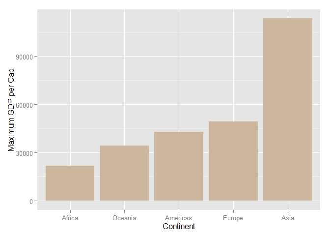

# Stat 545 Home Work 3
**Hamid Omid**  


<br> <br>
***

#Introduction

In this project, we are going to look deeper into "gapminder" data using "dplyr" library. You can find previous analyses in [Homework 2](https://github.com/STAT545-UBC/hamid_omid/blob/master/Home_Work_2/README.md). **GDP** per Capita and life expediency are going to be our favorite characters! We will first look at the extreme values of them and then explore their spread. We will examine the time evolution of life expectancy and try to find countries with interesting stories, whatever they are!

<br> <br>

***

# Loading the Data and Packages

Let's start by installing the packages that provides us with the data and libraries. 


```r
pkgTest <- function(x)
  {
    if (!require(x,character.only = TRUE))
    {
      install.packages(x,dep=TRUE)
        if(!require(x,character.only = TRUE)) stop("Package not found")
    }
  }    
```


```r
if (!require("gapminder",character.only = TRUE))
    {
      install.packages(x,dep=TRUE)
        if(!require(x,character.only = TRUE)) stop("Package not found")
      install.packages("gapminder",repos="http://cran.rstudio.com/")
    }
```


```r
pkgTest("ggplot2")
pkgTest("dplyr")
```


```r
library(gapminder)
library(ggplot2)
library(dplyr)
```

Lets put the data in "tbl" structure first.


```r
gapminder_tbl <- tbl_df(gapminder)
```

<br> <br>

***

# Extremes of GDP per Capita for All Continents


```r
gapminder %>% 
  group_by(continent) %>% 
  summarize(min_gdpPercap=min(gdpPercap)) %>% 
  arrange(min_gdpPercap)
```

```
## Source: local data frame [5 x 2]
## 
##   continent min_gdpPercap
## 1    Africa      241.1659
## 2      Asia      331.0000
## 3    Europe      973.5332
## 4  Americas     1201.6372
## 5   Oceania    10039.5956
```

Oceania seems to be an outlier in minimum GDP per Cap. Americas and Europe are relatively close in GDP per Cap. Asia and Africa both are behind by a factor of three from Europe and Americas. We should look at the spread to see the reasons behind that difference. We can have a better feeling about different continents' minimum GDP per Cap by plotting a histogram.We reorder the continents so that GDP per Cap increases in right direction.


```r
gapminder_tbl %>% 
  group_by(continent) %>% 
  summarize(min_gdpPercap=min(gdpPercap)) %>% 
ggplot(aes(reorder(x=factor(continent),min_gdpPercap), y=min_gdpPercap))+
 geom_histogram(stat="identity",fill="bisque4")+
 xlab("Continent")+
 ylab("Minimum GDP per Cap")
```

 

The plot shows clearly that Oceania has a min GDP per Cap which is almost one order of magnitude higher than other continents. Lets check how many countries are in that category. The high GDP might be a consequence of having few countries in that continent data.


```r
gapminder_tbl %>% 
  filter(continent=="Oceania") %>% 
  select(country) %>% 
  distinct()
```

```
## Source: local data frame [2 x 1]
## 
##       country
## 1   Australia
## 2 New Zealand
```

The function **"distinct()"** removes all of the similar rows. As we expected, there are few( only two) countries and both have a healthy economics. Lets continue by looking at the maximum of each continent and see if we see the same differences between the continents.


```r
gapminder_tbl %>% 
  group_by(continent) %>% 
  summarize(max_gdpPercap=max(gdpPercap))
```

```
## Source: local data frame [5 x 2]
## 
##   continent max_gdpPercap
## 1    Africa      21951.21
## 2  Americas      42951.65
## 3      Asia     113523.13
## 4    Europe      49357.19
## 5   Oceania      34435.37
```


```r
gapminder_tbl %>% 
  group_by(continent) %>% 
  summarize(max_gdpPercap=max(gdpPercap)) %>% 
  arrange(max_gdpPercap) %>% 
ggplot(aes(reorder(x=factor(continent),max_gdpPercap), y=max_gdpPercap))+
 geom_histogram(stat="identity",fill="bisque3")+
 xlab("Continent")+
 ylab("Maximum GDP per Cap")
```

 

We now see an outlier in Asia that has a GDP per Cap which is almost twice the highest GDP in other continents. The maximum GDP per Cap in other continents are close as we expect to have wealthy countries in all of continents that are competent with other wealthy countries belonging to other continents. The outlier in Asia might be one of the oil countries with low population. Let's remember that the data is yearly GDP and as a consequence there are data for the same country for various years. Lets check out the first ten high GDPs in Asia and their associated countries.


```r
gapminder_tbl %>% 
  filter(continent=="Asia") %>% 
  select(country,gdpPercap,year) %>% 
  arrange(gdpPercap) %>% 
  top_n(10,gdpPercap)
```

```
## Source: local data frame [10 x 3]
## 
##             country gdpPercap year
## 1  Hong Kong, China  39724.98 2007
## 2            Kuwait  40300.62 1997
## 3         Singapore  47143.18 2007
## 4            Kuwait  47306.99 2007
## 5            Kuwait  59265.48 1977
## 6            Kuwait  80894.88 1967
## 7            Kuwait  95458.11 1962
## 8            Kuwait 108382.35 1952
## 9            Kuwait 109347.87 1972
## 10           Kuwait 113523.13 1957
```

As we thought, an oil country, Kuwait, has the highest GDP in most of the years. [Kuwait](https://en.wikipedia.org/wiki/Kuwait) is a small country in middle east with a population of four millions and with an oil based economy. We already know the highest GDP, let's find the lowest GDP in our data. We expect it to be from Africa as Africa economy is vastly damaged due to civil wars.


```r
gapminder_tbl %>%
  select(country, gdpPercap, year) %>%
  filter(min_rank(desc(gdpPercap)) < 2 | min_rank(gdpPercap) < 2)
```

```
## Source: local data frame [2 x 3]
## 
##            country   gdpPercap year
## 1 Congo, Dem. Rep.    241.1659 2002
## 2           Kuwait 113523.1329 1957
```

We again find out that Kuwait has the highest GDP.["Congo, Dem. Rep."](https://en.wikipedia.org/wiki/Democratic_Republic_of_the_Congo) has the lowest GDP. Lets look at the Congo GDP over time.


```r
gapminder_tbl %>% 
  select(country,gdpPercap,year) %>%
  filter(country=="Congo, Dem. Rep.") %>% 
  arrange(year)
```

```
## Source: local data frame [12 x 3]
## 
##             country gdpPercap year
## 1  Congo, Dem. Rep.  780.5423 1952
## 2  Congo, Dem. Rep.  905.8602 1957
## 3  Congo, Dem. Rep.  896.3146 1962
## 4  Congo, Dem. Rep.  861.5932 1967
## 5  Congo, Dem. Rep.  904.8961 1972
## 6  Congo, Dem. Rep.  795.7573 1977
## 7  Congo, Dem. Rep.  673.7478 1982
## 8  Congo, Dem. Rep.  672.7748 1987
## 9  Congo, Dem. Rep.  457.7192 1992
## 10 Congo, Dem. Rep.  312.1884 1997
## 11 Congo, Dem. Rep.  241.1659 2002
## 12 Congo, Dem. Rep.  277.5519 2007
```

We looked up the news about Congo, Dem. Rep. and we found out that a [civil war](https://en.wikipedia.org/wiki/Second_Congo_War#1999.E2.80.932000) has started in 1996 and has continued to present. In 2002 a natural disaster has happened in Congo, Dem. Rep. and many people has been evacuated. It might be the reason behind the fall of economics beyond its fall because of the wars.

We looked for the reasons behind the Kuwait high GDP during 1950s. The fall after 1950s seems to be associated with accepting more immigrants during 1960s. You could find some nice data in [this](http://www.e.gov.kw/sites/kgoenglish/portal/Pages/Visitors/AboutKuwait/KuwaitAtaGlane_Population.aspx) governmental website.

<br> <br>

*** 

# Spread of GDP per Capita within the Continents

Lets look at the statistical structure of data more deeply. We can start by looking the average GDP for each continent and the standard deviation of it.


```r
gapminder_tbl %>% 
  select(gdpPercap,continent) %>% 
  group_by(continent) %>% 
  summarize(mean_gdpPercap=mean(gdpPercap),standard_deviation=sd(gdpPercap))
```

```
## Source: local data frame [5 x 3]
## 
##   continent mean_gdpPercap standard_deviation
## 1    Africa       2193.755           2827.930
## 2  Americas       7136.110           6396.764
## 3      Asia       7902.150          14045.373
## 4    Europe      14469.476           9355.213
## 5   Oceania      18621.609           6358.983
```

A better measure for dispersion of data is ["Coefficient of variation"](https://en.wikipedia.org/wiki/Coefficient_of_variation), CV. Let's plot CV for every continent.


```r
gapminder_tbl %>% 
  select(gdpPercap,continent) %>% 
  group_by(continent) %>% 
  summarize(mean_gdpPercap=mean(gdpPercap),standard_deviation=sd(gdpPercap)) %>% 
ggplot(aes(x=continent,y=standard_deviation/mean_gdpPercap))+
  geom_histogram(stat="identity",fill="bisque4")+
  xlab("Continent")+
  ylab("Coefficient of Variation for GDP per Cap")
```

 

Asia has a high CV as it has the highest GDP and at the same-time countries with low GDPs. Oceania has only two countries and clearly should have small CV as both of the countries are well developed and closely tied. As one expect, there is deviation in Americas and Europe as they contain countries that are members of "G8" and at the same-time they have countries that have major economic issues.

Let's look at a box-plot and it will make things even more clear! The box shows the first and second quantile and the median.


```r
ggplot(aes(x=continent, y=gdpPercap, fill=continent),data=gapminder_tbl)+
geom_point(alpha=1/5)+xlab("Continent")+ylab("GDP per Capita")+
geom_boxplot(alpha=.8)+guides(fill=FALSE)
```

 

We can see how skewed the data is for Asia, resulting in a big CV. Africa has a relatively small standard deviation as most of its the countries seem to be poor. Most of the countries have a GDP below 20,000, but the few countries above 30,000 make the plot less instructive. Let's restrict our-self to less than 30.000 and make the similar plot again.


```r
gapminder_tbl %>% 
  filter(gdpPercap<30000) %>% 
ggplot(aes(x=continent, y=gdpPercap, fill=continent))+
geom_point(alpha=1/5)+xlab("Continent")+ylab("GDP per Capita")+
geom_boxplot(alpha=.8)+guides(fill=FALSE)
```

 

The data is still skewed but we get a better feeling of GDP per Capita dispersion. Europe has a big standard deviation but at the same time most of the countries in it are wealthier than most of the countries in other continents. 

It should be instructive to look at each continent individually. Let's for example look at the evolution of average GDP in Europe. We start by average GDP evolution for the whole continent.


```r
gapminder_tbl %>% 
  filter(continent=="Europe") %>% 
  select(year,gdpPercap) %>% 
  group_by(year) %>% 
  summarize(average_gdpPercap_yearly_europe=mean(gdpPercap)) %>% 
ggplot(aes(x=year, y=average_gdpPercap_yearly_europe))+
  geom_path(color="darkgreen")+
  geom_jitter()+
  ylab("Average GDP Per Capita for Europe")+
  xlab("Year")
```

 

It shows that Europe has a economic growth since second world war. Lets look at more details by plotting the same diagram but for each European country individually.


```r
gapminder_tbl %>% 
  filter(continent=="Europe") %>% 
  select(year, gdpPercap, country) %>% 
  group_by(year,country) %>% 
  summarize(average_gdpPercap_yearly_europe=mean(gdpPercap)) %>% 
  ggplot(aes(x=year, y=average_gdpPercap_yearly_europe,color=country))+
  geom_point()+
  ylab("Average GDP Per Capita for Europe")+
  xlab("Year")
```

 


```r
gapminder_tbl %>% 
  filter(continent=="Europe") %>% 
  select(year, gdpPercap, country) %>% 
  group_by(year,country) %>% 
  summarize(average_gdpPercap_yearly_europe=mean(gdpPercap)) %>% 
  ggplot(aes(x=year, y=average_gdpPercap_yearly_europe,color=country))+
  geom_path()+
  ylab("Average GDP Per Capita for Europe")+
  xlab("Year")
```

 

The above plot shows that most of the European countries have continued to have economic growth  over time. There an era between 1990 and 1995 that some countries have experience a fall in their GDP. I tried to make the lines in color guide thicker but could not find the way.

<br> <br>

***

# Life Expectancy Change Over Time on Different Continents and Weighted Mean

In this section, we investigate the life expectancy change for different countries over time. As different countries have different population, we need to take that difference into account. Let's start by plotting life expectancy for individual countries in each continent.


```r
gapminder_tbl %>% 
ggplot(aes(x=year, y=lifeExp, color=country))+
  geom_point()+
  facet_wrap(~ continent, ncol=2)+
  xlab("Year")+
  ylab("Life EXpentancy")+
  guides(fill=FALSE)+
  theme(legend.position = "none")
```

 

Different countries are plotted by different colors. We observe that there is a major difference in the life expectancy between the continents however the life expectancy sees an increase as we get closer to present time. We are interested to compare the average life expectancy of the continents.


```r
gapminder_tbl %>% 
  group_by(continent, year) %>% 
  summarize(average_lifeExp=weighted.mean(lifeExp, pop)) %>% 
  ggplot(aes(x=year, y=average_lifeExp,color=continent))+
  geom_point(size=2.5)+
  geom_line()+
  ylab("Weighted Average Life Expectancy")+
  xlab("Year")
```

 

As one might expect the continents with low GDPs have a lower average life expectancy. We see the trend that the life expectancy is getting better over time. Asia has a fall in 1960s. Lets look at individual countries and see how the life expectancy in each Asian country has evolved. 


```r
gapminder_tbl %>% 
  filter(continent=="Asia") %>% 
  ggplot(aes(x=year, y=lifeExp,color=country))+
  geom_line()+
  ylab("Life Expectancy for Asian Countries")+
  xlab("Year")
```

 

It seems that not many countries had a decline in 1960s. Lets find the Asian countries that had a fall in their life expectancy in 1962 in comparison to 1957.


```r
asia <- gapminder_tbl %>% 
  filter(continent=="Asia",year==1957|year==1962)

for(i in 1:round(nrow(asia)/2,0)){if(asia[(2*i-1),4]-asia[2*i,4]>0){print(asia[2*i,1])}
}
```

```
## Source: local data frame [1 x 1]
## 
##   country
## 1   China
```

```r
remove(asia)
```

It is China, as we expected it to be a huge country to move the average on its own! Apparently, China has experiences some health issues in that era. In [Wikipedia](https://en.wikipedia.org/wiki/History_of_the_People%27s_Republic_of_China_(1949%E2%80%9376)), we found these information. " From 1960 to 1961, the combination of poor planning during the Great Leap Forward, political movements incited by the government, as well as unusual weather patterns and natural disasters resulted in widespread famine and many deaths."


<br> <br>

***

# Reflections

* "ggplot" makes life easy and hard at the same-time. One can enjoy the comfort it offers for plotting with a least amount of effort but at the same-time it is hard to customize the plots in a fine way.
* I love "pipe" now!

<br> <br>
