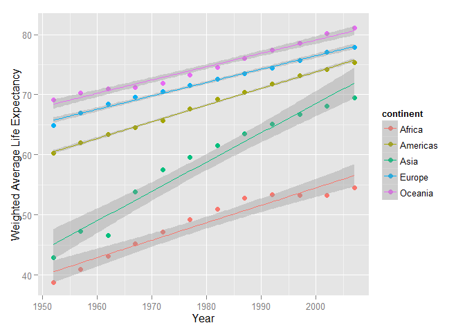
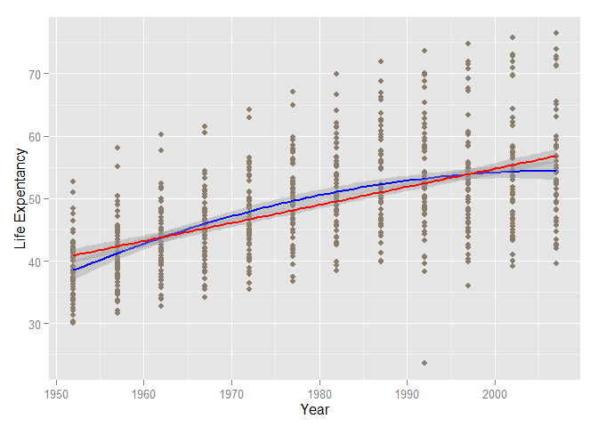
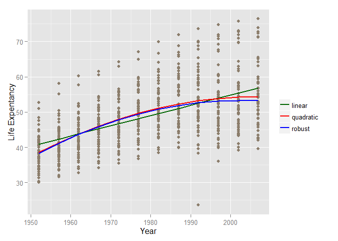
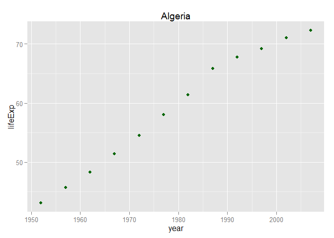
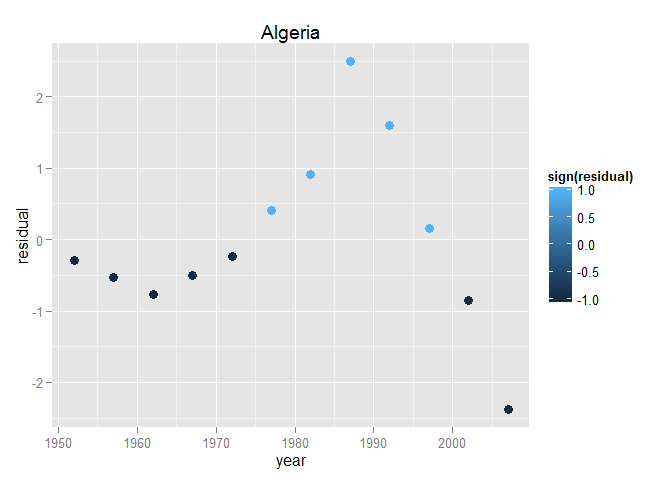

# Stat 545 Home Work 4
**Hamid Omid**  


<br> <br>

***

# Introduction

In this project we will get more familiar with writing functions in "R" and using them in exploring our data. We will assume introductory knowledge of regression models.

<br> <br>

***

# Loading the Data and Packages

Let's start by installing the packages that provides us with the data and libraries. 


```r
pkgTest <- function(x)
  {
    if (!require(x,character.only = TRUE))
    {
      install.packages(x,dep=TRUE)
        if(!require(x,character.only = TRUE)) stop("Package not found")
    }
  }    
```


```r
if (!require("gapminder",character.only = TRUE))
    {
      install.packages("gapminder",repos="http://cran.rstudio.com/")
    }
```


```r
pkgTest("ggplot2")
pkgTest("dplyr")
```

```
## Warning: package 'dplyr' was built under R version 3.2.2
```

```r
pkgTest("stringi")
```

```
## Warning: package 'stringi' was built under R version 3.2.2
```

```r
pkgTest("robustbase")
```

```
## Warning: package 'robustbase' was built under R version 3.2.2
```

```r
pkgTest("broom")
```

```
## Warning: package 'broom' was built under R version 3.2.2
```

The package "stringi" is needed for knitting the document and reduces the sensitivity to spacing in the first chunk that we defined the document. You could find more about it [here](https://cran.r-project.org/web/packages/stringi/stringi.pdf). 


```r
library(gapminder)
library(ggplot2)
library(dplyr)
library(stringi)
library(robustbase)
library(broom)
```

Lets put the data in "tbl" structure first.


```r
gapminder_tbl <- tbl_df(gapminder)
```

<br> <br>

***

# Life Expentancy Trend & Fitting Functions

Lets have a starting exploration of the life expectancy for different continents and decide about an appropriate regression model using our gained intuition. Here we look at the change of life expectancy over time.


```r
gapminder_tbl %>% 
  group_by(continent, year) %>% 
  summarize(average_lifeExp=weighted.mean(lifeExp, pop)) %>% 
  ggplot(aes(x=year, y=average_lifeExp,color=continent))+
  geom_point(size=2.5)+
  geom_smooth(method = "lm")+
  ylab("Weighted Average Life Expectancy")+
  xlab("Year")
```

 

It seems that a linear model works well for Europe and Americas however we might need to use more sophisticated models for Africa and Asia.

Lets define three functions in order to use them extensively for fitting our data. The two are based on least-square optimization. Later we define a new function that fits using a sophisticated method called robust optimization and we compare the residuals. We use ["Coefficient of Determination"](Coefficient of determination
) to check if our regression models work well.


```r
least_square_lin_fit <- function(dat, offset = 1952) {
  Linear <- I(dat$year - offset)
  the_fit <- lm(dat$lifeExp ~ Linear) 
  if(summary(the_fit)$r.squared <.75){
    print("You might want to use other fitting methods,  linear fitting using least squared optimizations has R^2<.75")
    return(the_fit)
  }
  else
    return(the_fit)       # this fucntion does linear regerssion based on leaset-squares
}
```


```r
least_square_quad_fit <- function(dat, offset = 1952) {
  Linear <- I(dat$year - offset)
  Quadratic <- I(dat$year - offset)^2
  the_fit <- lm(lifeExp ~ Linear +Quadratic, dat)
if(summary(the_fit)$r.squared <.75){
    print("You might want to use other fitting methods, quadratic fitting using least squared optimizations has R^2<.75" )
    return(the_fit)
  }
  else
    return(the_fit)        # this fucntion does degree two ploynimial regerssion based on least-square method
}
```


We can check our function on "Africa" and see if they seem to be working.


```r
snippet <- gapminder_tbl %>%      #snippet is a subset of gapminder, I remove it at the end of this chunk
  filter( continent=="Africa") 
  
  least_square_lin_fit( snippet)
```

```
## [1] "You might want to use other fitting methods,  linear fitting using least squared optimizations has R^2<.75"
```

```
## 
## Call:
## lm(formula = dat$lifeExp ~ Linear)
## 
## Coefficients:
## (Intercept)       Linear  
##     40.9033       0.2895
```

```r
  least_square_quad_fit( snippet)
```

```
## [1] "You might want to use other fitting methods, quadratic fitting using least squared optimizations has R^2<.75"
```

```
## 
## Call:
## lm(formula = lifeExp ~ Linear + Quadratic, data = dat)
## 
## Coefficients:
## (Intercept)       Linear    Quadratic  
##   38.531300     0.574166    -0.005175
```

```r
snippet %>% 
   ggplot(aes( x=year, y=lifeExp))+
   geom_point( color="bisque4")+
   geom_line( aes(x=year,y=predict( least_square_lin_fit( snippet)
   , I( snippet$year- 1952))), color="red", size=1)+
   geom_line( aes( x=year, y=predict( least_square_quad_fit( snippet)
   , I( snippet$year- 1952)+ I(( snippet$year- 1952)^2))), size=1, color="blue")+
   xlab("Year")+
   ylab("Life Expentancy")
```

 

```
## [1] "You might want to use other fitting methods,  linear fitting using least squared optimizations has R^2<.75"
## [1] "You might want to use other fitting methods, quadratic fitting using least squared optimizations has R^2<.75"
```

```r
remove(snippet)
```

Here we used the function **"predict()"** to get the fitted data.


The plot above could be produced using "ggplot" as well.


```r
gapminder_tbl %>% 
  filter( continent=="Africa") %>%
  ggplot( aes( x=year, y=lifeExp))+
   geom_point( color="bisque4")+
   stat_smooth( method = "lm", formula = y ~ x + I(x^2), size = 1, color="blue")+
   stat_smooth( method = "lm", formula = y ~ x , size = 1, colour="red")+
   xlab("Year")+
   ylab("Life Expentancy")
```

 

Lets use robust optimization and compare it to the other two methods.


```r
robust_quad_fit <- function(dat, offset = 1952) {
  Linear <- I(dat$year - offset)
  Quadratic <- I(dat$year - offset)^2
  the_fit <- lmrob(lifeExp ~ Linear +Quadratic, dat)
if(summary(the_fit)$r.squared <.75){
    print("You might want to use other fitting methods, quadratic fitting using least squared optimizations has R^2<.75" )
    return(the_fit)
  }
  else
    return(the_fit)               # this fucntion does robust degree two ploynimial regerssion based on least-square method
}
```


```r
snippet <- gapminder_tbl %>%      #snippet is a subset of gapminder, I remove it                                     at the end of this chunk
  filter( continent=="Africa") 
  
  least_square_lin_fit( snippet)
```

```
## [1] "You might want to use other fitting methods,  linear fitting using least squared optimizations has R^2<.75"
```

```
## 
## Call:
## lm(formula = dat$lifeExp ~ Linear)
## 
## Coefficients:
## (Intercept)       Linear  
##     40.9033       0.2895
```

```r
  robust_quad_fit( snippet)
```

```
## [1] "You might want to use other fitting methods, quadratic fitting using least squared optimizations has R^2<.75"
```

```
## 
## Call:
## lmrob(formula = lifeExp ~ Linear + Quadratic, data = dat)
##  \--> method = "MM"
## Coefficients:
## (Intercept)       Linear    Quadratic  
##   38.310184     0.593958    -0.005874
```

```r
  least_square_quad_fit( snippet)
```

```
## [1] "You might want to use other fitting methods, quadratic fitting using least squared optimizations has R^2<.75"
```

```
## 
## Call:
## lm(formula = lifeExp ~ Linear + Quadratic, data = dat)
## 
## Coefficients:
## (Intercept)       Linear    Quadratic  
##   38.531300     0.574166    -0.005175
```

```r
snippet %>% 
   ggplot(aes( x=year, y=lifeExp))+
   geom_point( color="bisque4")+
   geom_line( aes(x=year,y=predict( least_square_lin_fit( snippet)
   , I( snippet$year- 1952)), color="linear"), size=1)+
   geom_line( aes( x=year, y=predict( least_square_quad_fit( snippet)
   , I( snippet$year- 1952)+ I(( snippet$year- 1952)^2)), color="quadratic"), size=1, label="2nd degree robust")+
    geom_line( aes( x=year, y=predict( robust_quad_fit( snippet)
   , I( snippet$year- 1952)+ I(( snippet$year- 1952)^2)),color="robust"), size=1,  label="2nd degree robust")+
   xlab("Year")+
   ylab("Life Expentancy")+
   scale_colour_manual("", 
                      values = c("linear"="darkgreen", "quadratic"="red", 
                                 "robust"="blue"))
```

 

```
## [1] "You might want to use other fitting methods,  linear fitting using least squared optimizations has R^2<.75"
## [1] "You might want to use other fitting methods, quadratic fitting using least squared optimizations has R^2<.75"
## [1] "You might want to use other fitting methods, quadratic fitting using least squared optimizations has R^2<.75"
```

```r
remove(snippet)
```

<br> <br>

***

# Special Countries

We find special countries that linear fitting is not a good idea for them and have the highest residual. We define a function that gives such a country for each continent. Before writing the function lets do it manually for a given country, say "Algeria".

First lets plot the life expectancy an residuals for "Algeria."


```r
residual <- 
  gapminder_tbl %>% 
  group_by(continent) %>% 
  filter(country=="Algeria") %>% 
  least_square_lin_fit() %>% 
  residuals()
  
  
algeria_plot <- gapminder_tbl %>% 
  group_by( continent) %>% 
  filter( country=="Algeria") %>% 
  mutate( residual=residual) %>% 
ggplot( aes( x=year))

algeria_plot+geom_point( aes( y=lifeExp),color="darkgreen")+
  ggtitle( "Algeria")
```

 

```r
algeria_plot +
  geom_point( aes( y=residual, color=sign(residual)), size=3)+
  ggtitle( "Algeria")
```

 

We observe that between 1980 and 2007 the life expectancy shows a decrease in growth and subsequently the results become more positive as well. Lets find the the absolute value of biggest deviation from our linear fitting.


```r
gapminder_tbl %>% 
  filter(country=="Algeria") %>% 
  least_square_lin_fit() %>% 
  residuals  %>% 
  abs() %>% 
  max()
```

```
## [1] 2.499235
```

We can check that it belongs to the mentioned interval of time or more exactly to **2007**.

Lets find the maximum of residuals for each country and store it in a new data set called "gapminder_tbl_lin". We use **"do"** and **"augment"** to do so.


```r
 gapminder_tbl_lin<-
  gapminder_tbl %>% 
  group_by(country) %>% 
  do(augment(least_square_lin_fit(.),.))
```


```r
names(gapminder_tbl_lin)
```

```
##  [1] "country"    "continent"  "year"       "lifeExp"    "pop"       
##  [6] "gdpPercap"  ".fitted"    ".se.fit"    ".resid"     ".hat"      
## [11] ".sigma"     ".cooksd"    ".std.resid"
```

By "str"ing or using the "names()" on the outcome we find that this add a few new columns to our data including a column of residuals called ".resid".

Now let's define a function that gives us the country with highest residual in each continent.


```r
max_res_continent <- function(x_continent){
  if(x_continent %in% gapminder_tbl$continent & is.character(x_continent)){
 
  gapminder_tbl %>% 
  filter(continent==x_continent) %>% 
  group_by(country) %>% 
  do(augment(least_square_lin_fit(.),.)) %>% 
  ungroup() %>% 
  select(country,continent,year,.resid) %>% 
  arrange(abs(.resid)) %>% 
  tail(., n=1)
}

else {
    print ('I am sorry  please enter a valid continent name in the form of the continent as "Asia" .')
  }

    
}
```

Note that we need to **"ungroup()"** the data before using arrange. I was confused about it at the beginning.

<br> <br>

***

# Testing Our Function and Using it

Lets test our new function and see how it works. Our function is called "max_res_continent".


```r
max_res_continent("Asia")
```

```
## [1] "You might want to use other fitting methods,  linear fitting using least squared optimizations has R^2<.75"
## [1] "You might want to use other fitting methods,  linear fitting using least squared optimizations has R^2<.75"
## [1] "You might want to use other fitting methods,  linear fitting using least squared optimizations has R^2<.75"
```

```
## Source: local data frame [1 x 4]
## 
##    country continent  year    .resid
##     (fctr)    (fctr) (dbl)     (dbl)
## 1 Cambodia      Asia  1977 -15.69299
```

which is the correct result.


```r
max_res_continent("NA")
```

```
## [1] "I am sorry  please enter a valid continent name in the form of the continent as \"Asia\" ."
```

```r
max_res_continent("Hello")
```

```
## [1] "I am sorry  please enter a valid continent name in the form of the continent as \"Asia\" ."
```

```r
max_res_continent(gapminder_tbl_lin)
```

```
## Warning in if (x_continent %in% gapminder_tbl$continent &
## is.character(x_continent)) {: the condition has length > 1 and only the
## first element will be used
```

```
## [1] "I am sorry  please enter a valid continent name in the form of the continent as \"Asia\" ."
```

Now lets use "for()" to find the interesting country in every continent. I used the "lapply" to make a list of continents. The following code is not the most intelligent code but I didn't have more time to work on it.


```r
cont <-     # new variable having all of continents, we remove it later on
  gapminder_tbl %>% 
  select(continent) %>% 
  distinct() 

cont[] <- lapply( cont, as.character) 
  
continents_max <-  max_res_continent(cont$continent[1])

  
for(i in 2:5){ 

continents_max <-  rbind(continents_max, max_res_continent(cont$continent[i]))

}

remove(cont)
```


```r
knitr::kable(continents_max, align = 'c', format = 'markdown')
```


|   country   | continent | year |   .resid   |
|:-----------:|:---------:|:----:|:----------:|
|  Cambodia   |   Asia    | 1977 | -15.692993 |
|  Bulgaria   |  Europe   | 1952 | -6.137308  |
|   Rwanda    |  Africa   | 1992 | -17.309690 |
| El Salvador | Americas  | 1982 | -4.222187  |
| New Zealand |  Oceania  | 1977 | -1.287448  |

By a little bit of search, we could find out the reason behind big residuals for "Cambodia" and " Rwanda". As both the residuals are negative some disaster should have happens.

Cambodia has experienced a genocide, [https://en.wikipedia.org/wiki/Cambodian_genocide], between 1975 and 1979 in which an estimated one and a half to three million people died. Apparently Rwanda has experence a genocide around that era as well, [https://en.wikipedia.org/wiki/Rwandan_Genocide].  

<br> <br>

***

# Reflections

Unfortunately, I had to finish this assignment in rush. I thought I could change my status to "auditing" but turned out to not be the case. I heard back from **P+GS** today, Friday October 23rd and did the major part of work the same evening. It was my fault anyways!

I found using my own functions more demanding and I found working with data.frames harder than what I thought to be. Many of my codes did not work which made me to use less practical ways of analysis.

<br> <br>
