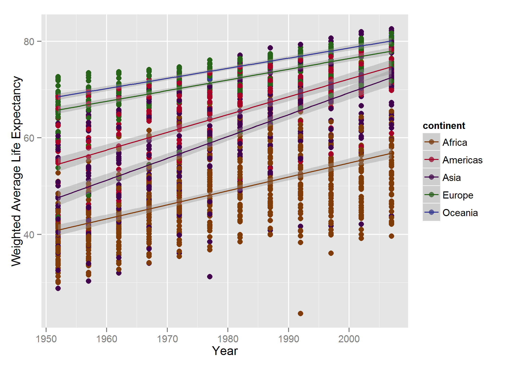
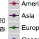

# Stat 545 Home Work 5
**Hamid Omid**  


<br> <br>

***

# Introduction

In this project we will get more familiar with levels and try to play with them. We are going to save figure without the devil mouse and call them back. We will try to incorporate some basic visualization Technics so that our document looks even nicer! This is the last document we make for **STAT 545**.

<br> <br>

***

# Loading the Data and Packages

Let's start by installing the packages that provides us with the data and libraries. We first write a function to check if a package is already installed or not.


```r
pkgTest <- function(x)
  {
    if (!require(x,character.only = TRUE))
    {
      install.packages(x,dep=TRUE)
        if(!require(x,character.only = TRUE)) stop("Package not found")
    }
  }    
```


```r
if (!require("gapminder",character.only = TRUE))
    {
      install.packages("gapminder",repos="http://cran.rstudio.com/")
    }
```


```r
pkgTest("ggplot2")
pkgTest("dplyr")
```

```
## Warning: package 'dplyr' was built under R version 3.2.2
```

```r
pkgTest("stringi")
```

```
## Warning: package 'stringi' was built under R version 3.2.2
```

```r
pkgTest("robustbase")
```

```
## Warning: package 'robustbase' was built under R version 3.2.2
```

```r
pkgTest("broom")
```

```
## Warning: package 'broom' was built under R version 3.2.2
```

```r
pkgTest("plyr")
pkgTest("gridExtra")
pkgTest("base")
pkgTest("knitr")
```

```
## Warning: package 'knitr' was built under R version 3.2.2
```

```r
pkgTest("car")
```

The package "stringi" is needed for knitting the document and reduces the sensitivity to spacing in the first chunk that we defined the document. You could find more about it [here](https://cran.r-project.org/web/packages/stringi/stringi.pdf). 


```r
library(gapminder)
library(ggplot2)
library(plyr)
library(dplyr)
library(stringi)
library(robustbase)
library(broom)
library(gridExtra)
library(base)
library(knitr)
options(knitr.table.format = "markdown")
library(car)
```

Lets put the data in "tbl" structure first.


```r
gapminder_tbl <- tbl_df(gapminder)
```

<br> <br>

***

# Factor management


***
## Drop Oceania

Lets first filter out the observations regarding Oceania.


```r
gapminder_minus_oceania <- 
  gapminder_tbl %>%
  filter(continent!="Oceania") 
```
We can check that the above removes the observations but still Oceania is one of the continent levels.


```r
gapminder_minus_oceania %>% 
  select(continent) %>% 
  distinct()
```

```
## Source: local data frame [4 x 1]
## 
##   continent
##      (fctr)
## 1      Asia
## 2    Europe
## 3    Africa
## 4  Americas
```

```r
levels( (gapminder_minus_oceania %>% 
  select(continent) %>% 
  distinct() )$continent)
```

```
## [1] "Africa"   "Americas" "Asia"     "Europe"   "Oceania"
```
We could remove Oceania from the levels by **droplevels()**.

```r
levels( (gapminder_minus_oceania %>% 
  select(continent) %>% 
  distinct() %>% 
  droplevels())$continent)
```

```
## [1] "Africa"   "Americas" "Asia"     "Europe"
```
Lets see how many rows got affected by removing Oceania.

```r
nrow(gapminder_tbl)-nrow(gapminder_minus_oceania)
```

```
## [1] 24
```

Lets see how our filtering changes the average life expectancy of the world! 


```r
detach("package:plyr", unload=TRUE)
library(dplyr)

d_full <- gapminder_tbl %>% 
  group_by(year) %>% 
  summarize( average_lifeExp = weighted.mean( lifeExp, pop))

d_without_oceania <-  gapminder %>% 
  filter(continent !="Oceania") %>% 
  group_by(year) %>% 
  summarize( average_lifeExp = weighted.mean( lifeExp, pop)) 

d_without_oceania <-
  d_without_oceania %>% 
  rename(average_lifeExp_without_oceania=average_lifeExp)

data_snippet <- merge( d_full, d_without_oceania, by=c("year"))

data_snippet %>% 
  ggplot(aes( x= year))+
  geom_line( aes( y= average_lifeExp), color="#7F3B08")+
  geom_line( aes( y= average_lifeExp_without_oceania), color="#313695")
```

 

```r
remove( d_without_oceania, d_full, data_snippet)
```
We see that it almost has no effect as the population of "Oceania" is small. Lets see what happens if we remove "Asia"! **Note that in rename() new name is equal the previous one ( new=previous) not the other way around!**


```r
d_full <- gapminder_tbl %>% 
  group_by(year) %>% 
  summarize( average_lifeExp = weighted.mean( lifeExp, pop))

d_without_asia <-  gapminder %>% 
  filter(continent !="Asia") %>% 
  group_by(year) %>% 
  summarize( average_lifeExp = weighted.mean( lifeExp, pop)) 

names(d_without_asia) <- c("year","average_lifeExp_without_asia")

data_snippet <- merge( d_full, d_without_asia, by="year")

data_snippet %>% 
  ggplot(aes( x= year))+
  geom_line( aes( y= average_lifeExp), color="#7F3B08")+
  geom_line( aes( y= average_lifeExp_without_asia), color="#313695")
```

 

```r
remove( d_without_asia, d_full, data_snippet)
```
Now we see a huge difference as "Asia" has a huge population. 

<br> <br>

***
## Reorder the levels of country or continent

Lets first make a function that uses linear regression for finding intercept. We use the intercept for each continent to reorder the factors.


```r
intercept_fun <- function(cont) {
  data <- gapminder_tbl %>% 
    filter(continent==cont)
  lm(data$lifeExp~I(data$year-min(data$year)))$coefficients[[1]]
  }


gapminder_tbl_reodered <- within( gapminder_tbl, continent <- reorder( continent, continent, intercept_fun))
```
We will see that the continents are reordered. Lets use "ddply" and "plyr"  to find the intercepts again. We could have used the above to find intercept for each continent but it would have been harder to use the output for "reorder" as the dimension of output is different than the needed input for reorder and we get the following error. We store the intercept in data.frame **"coef"** and then plot the result to show the effect of "reorder()" and "arrange()" on inputs.


```r
intercept_fun <- function(data){
  
  the_fit <-lm(lifeExp~I(year-min(year)), data)#$coefficients[[1]] we could put this part and use it for ddply() but it would have generate errors for do()

  setNames(data.frame(t(coefficients(the_fit))),c("intercept", "slope"))
  
}

library(plyr)
coef <- ddply(gapminder_tbl,~continent, intercept_fun)
library(dplyr)

detach("package:plyr", unload=TRUE)
```

```
## Warning: 'plyr' namespace cannot be unloaded:
##   namespace 'plyr' is imported by 'broom', 'scales', 'reshape2', 'ggplot2' so cannot be unloaded
```

```r
library(dplyr)         

coef <- gapminder_tbl %>%    # second way of finding coeficents for every continent
  group_by(continent) %>% 
  do(intercept_fun(.))


p3 <- ggplot(coef, aes( x=reorder( continent, intercept), y=intercept))+
  geom_point(size=5, aes( color= continent))+
  scale_colour_manual(values = continent_colors)+ 
  xlab("continent")+
  ggtitle("Intercept Plot")

p2 <-  ggplot(gapminder_tbl_reodered,aes(x=continent))+
  geom_histogram( aes( fill=continent))+
  scale_fill_manual(values = continent_colors)+ 
  ggtitle("Reordered Plot")


p1 <-  ggplot(gapminder_tbl,aes(x=continent))+
  geom_histogram(aes( fill=continent))+
  scale_fill_manual(values = continent_colors)+ 
  ggtitle("Original Order Plot")

grid.arrange(p1, p2, p3, ncol=1)
```

 

```r
remove( p1, p2, p3)
```


```r
reorder( gapminder_tbl$continent, intercept_coe) # We should make a new matrix for intercepts with the same dimension as gapminder_tbl$continent to avoid the error
```


The above plott show that we have reordered everything by intercept. Lets check out "arrange()" effect now with "reorder()" and without it.


```r
p1 <- coef %>% 
  ggplot( aes( x= continent, y=intercept))+
  geom_point(size=5, aes( color=continent))+
  scale_colour_manual(values = continent_colors) +
  xlab("continent")+
  ggtitle("Original Intercept Plot")

p2 <- coef %>%
  arrange(intercept) %>% 
  ggplot( aes( x= continent, y=intercept))+
  geom_point(size=5, aes( color=continent))+
  scale_colour_manual(values = continent_colors)+ 
  xlab("continent")+
  ggtitle("Arranged Intercept Plot")

p3 <- coef %>%
  within( continent <- reorder(continent,intercept)) %>% 
  arrange(intercept) %>% 
  ggplot( aes( x= continent , y=intercept))+
  geom_point(size=5, aes(color=continent))+
  scale_colour_manual(values = continent_colors)+ 
  xlab("continent")+
  ggtitle("ReOrdered + Arranged Intercept Plot")

grid.arrange(p1, p2, p3, ncol=1)
```

 

```r
remove( p1, p2, p3)
```

Here we used **"within()"** with "piping" to be able using "reorder()". We see that arranging has no effect on figure, we expect that arranging does not change the ordering of levels either. Lets check it!


```r
levels( coef$continent)
```

```
## [1] "Africa"   "Americas" "Asia"     "Europe"   "Oceania"
```

```r
levels( (coef %>%
  arrange(intercept) )$continent )
```

```
## [1] "Africa"   "Americas" "Asia"     "Europe"   "Oceania"
```

```r
levels( (coef %>%
  within( continent <- reorder(continent,intercept)))$continent ) 
```

```
## [1] "Africa"   "Asia"     "Americas" "Europe"   "Oceania"
```

```r
levels( (coef %>%
  within( continent <- reorder(continent,intercept)) %>% 
    arrange(continent) )$continent ) 
```

```
## [1] "Africa"   "Asia"     "Americas" "Europe"   "Oceania"
```

We confirm our guess! We can look at the data itself, we expect that arrange function would sort the data when viewed but order would not do the same.


```r
coef
```

```
## Source: local data frame [5 x 3]
## Groups: continent [5]
## 
##   continent intercept     slope
##      (fctr)     (dbl)     (dbl)
## 1    Africa  40.90328 0.2895293
## 2  Americas  54.54834 0.3676509
## 3      Asia  47.60404 0.4531224
## 4    Europe  65.80055 0.2219321
## 5   Oceania  68.54372 0.2102724
```

```r
coef %>%
  arrange(intercept)
```

```
## Source: local data frame [5 x 3]
## Groups: continent [5]
## 
##   continent intercept     slope
##      (fctr)     (dbl)     (dbl)
## 1    Africa  40.90328 0.2895293
## 2  Americas  54.54834 0.3676509
## 3      Asia  47.60404 0.4531224
## 4    Europe  65.80055 0.2219321
## 5   Oceania  68.54372 0.2102724
```

```r
coef %>%
  within( continent <- reorder(continent,intercept))
```

```
## Source: local data frame [5 x 3]
## Groups: continent [5]
## 
##   continent intercept     slope
##      (fctr)     (dbl)     (dbl)
## 1    Africa  40.90328 0.2895293
## 2  Americas  54.54834 0.3676509
## 3      Asia  47.60404 0.4531224
## 4    Europe  65.80055 0.2219321
## 5   Oceania  68.54372 0.2102724
```

```r
coef %>%
  within( continent <- reorder(continent,intercept)) %>% 
    arrange(continent)
```

```
## Source: local data frame [5 x 3]
## Groups: continent [5]
## 
##   continent intercept     slope
##      (fctr)     (dbl)     (dbl)
## 1    Africa  40.90328 0.2895293
## 2      Asia  47.60404 0.4531224
## 3  Americas  54.54834 0.3676509
## 4    Europe  65.80055 0.2219321
## 5   Oceania  68.54372 0.2102724
```

We confirm our guess again!


***

# Visualization design

During Jenny lecture and Tamara lecture, I found out about importance of colors, here are recopy a plot I made previously you can visit the original document [here](https://github.com/STAT545-UBC/hamid_omid/blob/master/Home_Work_3/Home_Work_3.md), and use built-in color package in "gapminder" to make it look better.


```r
gapminder_tbl %>% 
ggplot(aes(x=year, y=lifeExp, color=country))+
  geom_point()+
  facet_wrap(~ continent, ncol=2)+
  xlab("Year")+
  ylab("Life EXpentancy")+
  guides(fill=FALSE)+
  ggtitle("Original Colors")+
  theme(legend.position = "none")
```

 

```r
gapminder_tbl %>% 
ggplot(aes(x=year, y=lifeExp, color=country))+
  geom_point()+
  scale_colour_manual(values = country_colors) +
  facet_wrap(~ continent, ncol=2)+
  xlab("Year")+
  ylab("Life EXpentancy")+
  guides(fill=FALSE)+
  ggtitle("Improved Colors")+
  theme(legend.position = "none")
```

 

I used the same lesson for choosing colors for my previous graphs of this document as well. In the same document, I made the following plot which I rather substitute it with the newer version.


```r
gapminder_tbl %>% 
  select(gdpPercap,continent) %>% 
  group_by(continent) %>% 
  summarize(mean_gdpPercap=mean(gdpPercap),standard_deviation=sd(gdpPercap)) %>% 
ggplot(aes(x=continent,y=standard_deviation/mean_gdpPercap))+
  geom_histogram(stat="identity",fill="bisque4")+
  xlab("Continent")+
  ylab("Coefficient of Variation for GDP per Cap")
```

 


```r
gapminder_tbl %>% 
  select(gdpPercap,continent) %>% 
  group_by(continent) %>% 
  summarize( mean_gdpPercap = mean( gdpPercap), standard_deviation=sd(gdpPercap)) %>% 
ggplot( aes(x = reorder( continent, standard_deviation/mean_gdpPercap) , y = standard_deviation/mean_gdpPercap))+
  geom_histogram( stat = "identity",aes( fill=continent))+
  scale_fill_manual(values = continent_colors)+ 
  xlab("Continent")+
  ylab("Coefficient of Variation for GDP per Cap")
```

 
<br> <br>

***

# Writing figures to file

In this section we play with **"ggsave()"**. I want to save the plots in a file an then read them directly from my directory.


***

## Arguments of ggsave()

Lets make a plot so that we can save it!


```r
test_plot <- gapminder_tbl %>% 
  ggplot( aes(x= year, y=lifeExp, color=continent))+
  scale_colour_manual(values = continent_colors) +
  geom_point(size=2.5)+
  geom_smooth(method = "lm")+
  ylab("Weighted Average Life Expectancy")+
  xlab("Year")
```
Saving is easy! **We need to set the working directory to the one that knitting would happen in. It is the directory that our "Rmd" file lives in, otherwise we get an error when we try to knit!**

```r
ggsave(filename = "ggsave/test_plot.png", plot = test_plot)
```

```
## Saving 7 x 5 in image
```
Now lets call the plot here. 

I could not call "PDF" files and have them as an image, which was weird for me that have used to Latex.

Let's play with "ggsave()" a bit more. We first change the height, width and resolution of our plot.


```r
ggsave(filename = "ggsave/test_plot_6_2.png", plot = test_plot,width = 6, height = 2, units = c("in", "cm",
  "mm"), dpi = 300)
```

We saved the plot with six inch in width, two centimeter in height and 300 dpi resolution just for fun. 

Lets explore scaling now!


```r
ggsave(filename = "ggsave/test_plot_scaled_bigger.png", plot = test_plot, scale=1.5, limitsize = TRUE)
```

```
## Saving 10.5 x 7.5 in image
```

```r
ggsave(filename = "ggsave/test_plot_scaled_smaller.png", plot = test_plot, scale=0.5, limitsize = TRUE)
```

```
## Saving 3.5 x 2.5 in image
```
<br>

I turned on the "limitsize" option to avoid save images larger than 50x50 inches. Here is our over-scaled plot.   For scaled up one, we see that data has spread over a larger area and as the result data points and labels look smaller in contrast to scaling when copying the plot using a photocopier! For the same reason, the scale downed one look ugly. Actually if we scale it to the tenth of original just the legend remains!

<br>

***

## Various graphics devices

Up to now, we used "png" which is a "raster" format, we could use "svg" which is a vector format. To see the difference between the two, lets scale everything down by a factor of ten and the scale up when reading the file!


```r
ggsave(filename = "ggsave/test_plot_tenth.png", plot = test_plot, width = 2, height = 2, units = "cm")

ggsave(filename = "ggsave/test_plot_tenth.svg", plot = test_plot, width = 2, height = 2, units = "cm")
```




**The SVG file doesn't embed correctly in "md file" but works in perfectly in "html" file!**
Although the pictures are not nice, they show the fact that vector form keeps its resolution while the dots in raster form start to show up, look at the "a"s on the far left.

<br>

***

## Explicit provision of the plot object 

I already have used this option in previous parts. This option helps to save plots that are stored in memory but are not the last we have drew. 


***

# But I want to do more!: Revalue a factor

Here we pick six countries and map them to their capital, not hard! We first use "revalue" from "plyr".


```r
our_countries <- c("Canada", "Germany", "Chile", "Egypt", "China", "Togo")

gapminder_tbl %>% 
  filter(country %in% our_countries) %>% 
  droplevels() %>% 
  mutate(capital = plyr::revalue(country, c(Canada = "Ottawa", 
    Germany = "Berlin", Chile = "Santiago", Egypt = "Cairo", China = "Peiking", Togo="Lomé"))) %>% 
  sample_n(10) %>% 
  kable()
```


|country |continent | year|  lifeExp|        pop|  gdpPercap|capital  |
|:-------|:---------|----:|--------:|----------:|----------:|:--------|
|Chile   |Americas  | 1977| 67.05200|   10599793|  4756.7638|Santiago |
|Germany |Europe    | 1962| 70.30000|   73739117| 12902.4629|Berlin   |
|Germany |Europe    | 1977| 72.50000|   78160773| 20512.9212|Berlin   |
|China   |Asia      | 1962| 44.50136|  665770000|   487.6740|Peiking  |
|China   |Asia      | 1987| 67.27400| 1084035000|  1378.9040|Peiking  |
|Togo    |Africa    | 1962| 43.92200|    1528098|  1067.5348|Lomé     |
|China   |Asia      | 1977| 63.96736|  943455000|   741.2375|Peiking  |
|Germany |Europe    | 1972| 71.00000|   78717088| 18016.1803|Berlin   |
|China   |Asia      | 1957| 50.54896|  637408000|   575.9870|Peiking  |
|Canada  |Americas  | 1982| 75.76000|   25201900| 22898.7921|Ottawa   |

Let's add their national food that Google tells us, using "recode()" from "car" package.


```r
gapminder_tbl %>% 
  filter(country %in% our_countries) %>% 
  droplevels() %>% 
  mutate(food = recode(country," 'Canada' = 'Poutine'; 
  'Germany' = 'Sauerkraut'; 'Chile' = 'Chapalele'; 'Egypt' = 'Ful Medames' ; 'China' = 'Peking duck'; 'Togo'='Maize' ")) %>% 
  sample_n(10) %>% 
  kable()
```


|country |continent | year|  lifeExp|       pop|  gdpPercap|food        |
|:-------|:---------|----:|--------:|---------:|----------:|:-----------|
|Chile   |Americas  | 2007| 78.55300|  16284741| 13171.6388|Chapalele   |
|Canada  |Americas  | 1977| 74.21000|  23796400| 22090.8831|Poutine     |
|Germany |Europe    | 2002| 78.67000|  82350671| 30035.8020|Sauerkraut  |
|China   |Asia      | 1972| 63.11888| 862030000|   676.9001|Peking duck |
|Egypt   |Africa    | 1982| 56.00600|  45681811|  3503.7296|Ful Medames |
|Canada  |Americas  | 1997| 78.61000|  30305843| 28954.9259|Poutine     |
|Germany |Europe    | 1982| 73.80000|  78335266| 22031.5327|Sauerkraut  |
|Togo    |Africa    | 1992| 58.06100|   3747553|  1034.2989|Maize       |
|China   |Asia      | 1962| 44.50136| 665770000|   487.6740|Peking duck |
|Germany |Europe    | 1992| 76.07000|  80597764| 26505.3032|Sauerkraut  |

```r
remove(our_countries)
```
Hopefully, Google results did not offend you! We see that it was pretty easy to revalue a factor! 


***

# Reflections

* It's good to know more about visualization and using it, although it is hard for me at the moment.
* I had few issues with "dplyr" interfering with "plyr"
* I find it hard to work with "do()" in "dplyr" and like "ddply()" better
* It was a nice semester thanks for teaching me a lot!

<br> <br> <br> <br>


